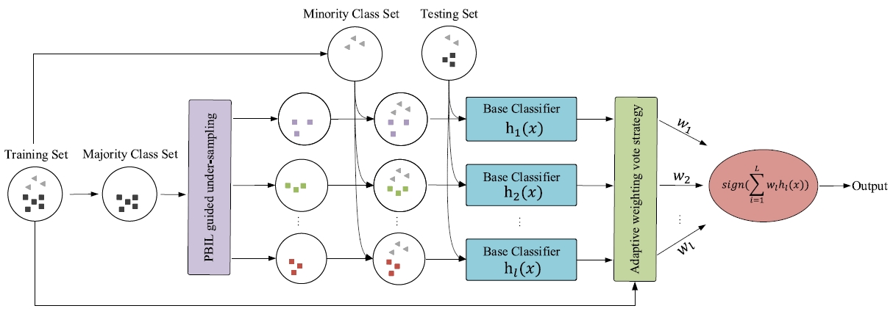
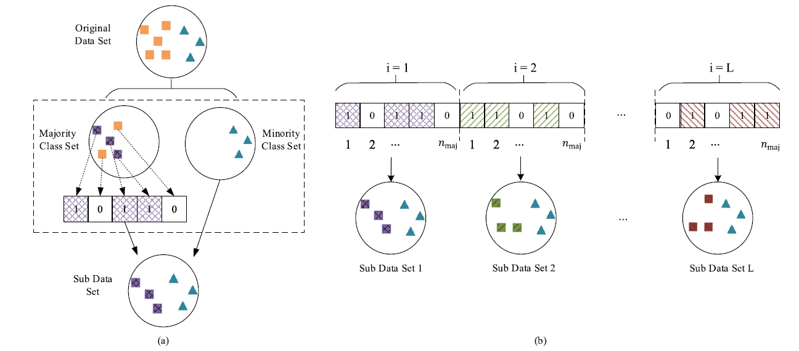

# P-EUSBagging  
Implementation of the paper:  
*Imbalanced Ensemble Learning Leveraging a Novel Data-Level Diversity Metric*  

---

## Framework Overview  
### PBIL-Guided Imbalanced Ensemble Model  
  

### Evolutionary Undersampling Process  
  

---

## Datasets  
44 imbalanced datasets from [KEEL repository](https://sci2s.ugr.es/keel/description.php).  

---

## Requirements  
- Python 3.7  
- Scikit-Learn ≥1.0.2  

---

## Code Structure  
| File | Description |  
|------|-------------|  
| `main.py` | Main execution script |  
| `readData.py` | Loads KEEL `.dat` format datasets |  
| `pbil/optimizer.py` | Population-Based Incremental Learning (PBIL) implementation |  

---

## Citation  
If this work aids your research, please cite:  
```bibtex
@article{PANG2025110886,
  title={Imbalanced ensemble learning leveraging a novel data-level diversity metric},
  journal={Pattern Recognition},
  volume={157},
  pages={110886},
  year={2025},
  author={Pang, Ying and Peng, Lizhi and Zhang, Haibo and Chen, Zhenxiang and Yang, Bo}
}